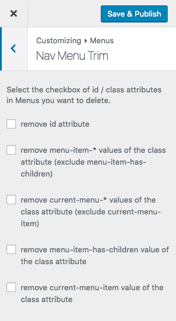

# Introducing Nav Menu Trim

This WordPress plugin trim html id/class attributes of Nav Menu.

## Installation

1. Download and unzip files. Or install **Nav Menu Trim** using the WordPress plugin installer. In that case, skip 2.
2. Upload **nav-menu-trim** to the "/wp-content/plugins/" directory.
3. Activate the plugin through the 'Plugins' menu in WordPress.
4. Configure settings through the **Appearance > Customize > Menus > Nav Menu Trim** menu in WordPress.
5. Have fun!

## Hooks

### Filter hooks

* `nav_menu_trim_get_options` - Filters the options
* `nav_menu_trim_get_option` - Filters the option

## Screenshot

### Appearance > Customize > Menus

### Nav Menu Trim options

## WordPress Plugin Directory

Nav Menu Trim is hosted on the WordPress Plugin Directory.

[https://wordpress.org/plugins/nav-menu-trim/](https://wordpress.org/plugins/nav-menu-trim/)

## Test Matrix

For operation compatibility between PHP version and WordPress version, see below [Travis CI](https://travis-ci.org/thingsym/nav-menu-trim)

## Contribution

### Patches and Bug Fixes

Small patches and bug reports can be submitted a issue tracker in Github. Forking on Github is another good way. You can send a pull request.

1. Fork [Nav Menu Trim](https://github.com/thingsym/nav-menu-trim) from GitHub repository
2. Create a feature branch: git checkout -b my-new-feature
3. Commit your changes: git commit -am 'Add some feature'
4. Push to the branch: git push origin my-new-feature
5. Create new Pull Request

## Changelog

* Version 1.1.2
	* rename sanitize_callback function from sanitize_checkbox to sanitize_boolean
	* fix indent and reformat with phpcs and phpcbf
	* add composer.json for test
	* add static code analysis config
* Version 1.1.1
	* fix access modifier
	* fix tests
	* fix PHPDoc comment
	* fix filter nav_menu_trim_get_options and nav_menu_trim_get_option
	* change to add_action with load_textdomain
	* add sanitize_checkbox
* Version 1.1.0
	* update screenshot
	* fix PHPDoc comment
	* remove $languages_path
	* fix .travis.yml
	* fix tests
	* add nav_menu_submenu_css_class function
	* fix get_options function
	* add default_options
	* fix load_textdomain
	* rename funtion name from trim_css_class to trim_menu_css_class
* Version 1.0.2
	* fix tests
	* fix data validation via wp_kses
	* change output css to here document
	* fix option detect
	* change add_filter from plugin_action_links to plugin_action_links_{$plugin_file}
	* add init function
	* fix codesniffer.ruleset.xml
* Version 1.0.1
	* fixed: fix .travis.yml
	* fixed: fix trim_css_class function
	* fixed: check exists class
* Version 1.0.0
	* initial release

## Upgrade Notice

* 1.1.1
	* Requires at least version 3.8 of the WordPress

## License

Licensed under [GPLv2](https://www.gnu.org/licenses/gpl-2.0.html).
