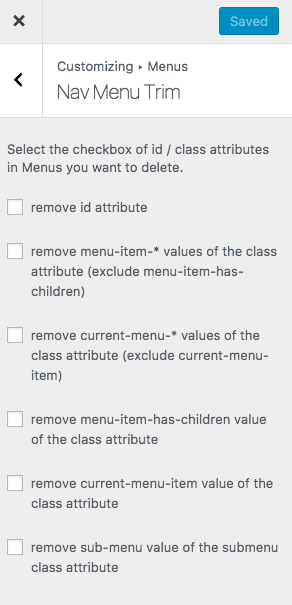

# Introducing Nav Menu Trim

Nav Menu Trim plugin trim html id/class attributes of Nav Menu.

## Installation

1. Download and unzip files. Or install **Nav Menu Trim** using the WordPress plugin installer. In that case, skip 2.
2. Upload **nav-menu-trim** to the "/wp-content/plugins/" directory.
3. Activate the plugin through the 'Plugins' menu in WordPress.
4. Configure settings through the **Appearance > Customize > Menus > Nav Menu Trim** menu in WordPress.
5. Have fun!

## Hooks

### Filter hooks

* `nav_menu_trim_get_options` - Filters the options
* `nav_menu_trim_get_option` - Filters the option

## Screenshot

### Appearance > Customize > Menus

### Nav Menu Trim options

## WordPress Plugin Directory

Nav Menu Trim is hosted on the WordPress Plugin Directory.

[https://wordpress.org/plugins/nav-menu-trim/](https://wordpress.org/plugins/nav-menu-trim/)

## Support

If you have any trouble, you can use the forums or report bugs.

* Forum: [https://wordpress.org/support/plugin/nav-menu-trim/](https://wordpress.org/support/plugin/nav-menu-trim/)
* Issues: [https://github.com/thingsym/nav-menu-trim/issues](https://github.com/thingsym/nav-menu-trim/issues)

## Contribution

Small patches and bug reports can be submitted a issue tracker in Github.

Translating a plugin takes a lot of time, effort, and patience. I really appreciate the hard work from these contributors.

If you have created or updated your own language pack, you can send gettext PO and MO files to author. I can bundle it into plugin.

* VCS - Github: [https://github.com/thingsym/nav-menu-trim/](https://github.com/thingsym/nav-menu-trim/)
* [Translate Nav Menu Trim into your language.](https://translate.wordpress.org/projects/wp-plugins/nav-menu-trim)

You can also contribute by answering issues on the forums.

* Forum: [https://wordpress.org/support/plugin/nav-menu-trim/](https://wordpress.org/support/plugin/nav-menu-trim/)
* Issues: [https://github.com/thingsym/nav-menu-trim/issues](https://github.com/thingsym/nav-menu-trim/issues)

### Patches and Bug Fixes

Forking on Github is another good way. You can send a pull request.

1. Fork [Nav Menu Trim](https://github.com/thingsym/nav-menu-trim) from GitHub repository
2. Create a feature branch: git checkout -b my-new-feature
3. Commit your changes: git commit -am 'Add some feature'
4. Push to the branch: git push origin my-new-feature
5. Create new Pull Request

### Contribute guidlines

If you would like to contribute, here are some notes and guidlines.

* All development happens on the **develop** branch, so it is always the most up-to-date
* The **master** branch only contains tagged releases
* If you are going to be submitting a pull request, please submit your pull request to the **develop** branch
* See about [forking](https://help.github.com/articles/fork-a-repo/) and [pull requests](https://help.github.com/articles/using-pull-requests/)

## Test Matrix

For operation compatibility between PHP version and WordPress version, see below [Github Actions](https://github.com/thingsym/nav-menu-trim/actions).

## Changelog

* Version 1.2.3
	* add composer script
	* remove makepot:php composer script
	* change makepot from php script to wp cli
	* change plugin initialization to plugins_loaded hook
	* replace assert from assertEquals to assertSame
* Version 1.2.2
	* fix wp-plugin-unit-test.yml
	* add Upgrade Notice
	* change requires at least to wordpress 4.9
	* change requires to PHP 5.6
	* bump up yoast/phpunit-polyfills version
	* update wp-plugin-unit-test.yml
	* change os to ubuntu-20.04 for ci
	* add wp-plugin-unit-test-matrix.yml
* Version 1.2.1
	* add test case for customizer
	* update composer dependencies
	* change from protected variable to public variable for unit test
	* add timeout-minutes to workflows
	* add phpunit-polyfills
	* tested up to 5.8.0
* Version 1.2.0
	* tested up to 5.7.0
	* add composer scripts
	* update japanese translation
	* update pot
	* add test case
	* change constant name
	* add sponsor link
	* add FUNDING.yml
	* add donate link
	* update wordpress-test-matrix
	* add GitHub actions for CI/CD, remove .travis.yml
* Version 1.1.2
	* rename sanitize_callback function from sanitize_checkbox to sanitize_boolean
	* fix indent and reformat with phpcs and phpcbf
	* add composer.json for test
	* add static code analysis config
* Version 1.1.1
	* fix access modifier
	* fix tests
	* fix PHPDoc comment
	* fix filter nav_menu_trim_get_options and nav_menu_trim_get_option
	* change to add_action with load_textdomain
	* add sanitize_checkbox
* Version 1.1.0
	* update screenshot
	* fix PHPDoc comment
	* remove $languages_path
	* fix .travis.yml
	* fix tests
	* add nav_menu_submenu_css_class function
	* fix get_options function
	* add default_options
	* fix load_textdomain
	* rename funtion name from trim_css_class to trim_menu_css_class
* Version 1.0.2
	* fix tests
	* fix data validation via wp_kses
	* change output css to here document
	* fix option detect
	* change add_filter from plugin_action_links to plugin_action_links_{$plugin_file}
	* add init function
	* fix codesniffer.ruleset.xml
* Version 1.0.1
	* fixed: fix .travis.yml
	* fixed: fix trim_css_class function
	* fixed: check exists class
* Version 1.0.0
	* initial release

## Upgrade Notice

* Version 1.2.2
	* Requires at least version 4.9 of the WordPress
	* Requires PHP version 5.6
* Version 1.1.1
	* Requires at least version 3.8 of the WordPress

## License

Licensed under [GPLv2](https://www.gnu.org/licenses/gpl-2.0.html).
