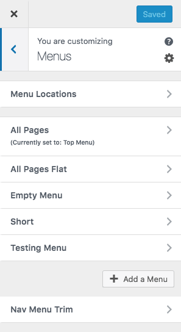

# Introducing Nav Menu Trim

This WordPress plugin trim html id/class attributes of Nav Menu.

## Installation

1. Download and unzip files. Or install Nav Menu Trim using the WordPress plugin installer. In that case, skip 2.
2. Upload "nav-menu-trim" to the "/wp-content/plugins/" directory.
3. Activate the plugin through the 'Plugins' menu in WordPress.
4. Configure settings through the 'Appearance > Customize > Menus > Nav Menu Trim' menu in WordPress.
5. Have fun!

## Screenshot

### Appearance > Customize > Menus

### Nav Menu Trim options

## Changelog

* Version 1.0.0
	* initial release
